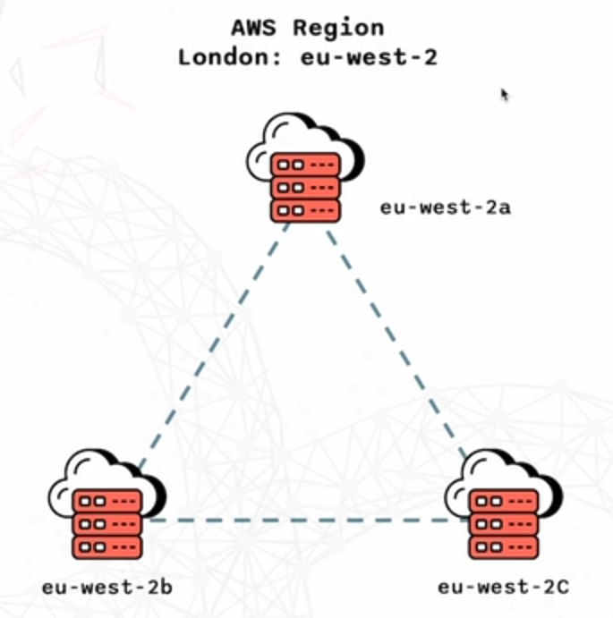

# **INTRODUCTION**

## What it is?

**AWS** is short for (Amazon web services), it was originally designed as the infrastructure used for Amazons website and later on became public for others as a service.

## Use cases:

- Hosting websites, mobile and social apps
- Back up
- Storage
- Data analytics
- Hosts online gaming for smooth **global** gameplay gaming

## **AWS Regions**

A region contains multiple data centre which have a cluster of servers, AWS has regions around the world. Having multiple data centres helps ensure redundancy and high availability for your applications because when something goes wrong AWS can automatically switch to another data centre. An example is **“eu-west3”.**

## How to choose a region?

### Things to consider:

- **Data compliance**- Some businesses have a legal requirement to not let data leave the country/region so having multiple options for regions is good.
- **Proximity**- The closer the data centre is to the customers using it the faster response times are/lower latency.
- **Service availability**- Not all the services are available in every region
- **Pricing-** The prices vary in each region depending on demands, operating factors and local costs

## **Availability Zones**

### What it is?

Each AWS region has usually 3-6 availability zones, which are made up of one or more data centres each with their own redundant power. They are isolated from each other incase of a disaster so that high availability can be maintained. They also are connected with a high bandwidth and very low latency networking.

