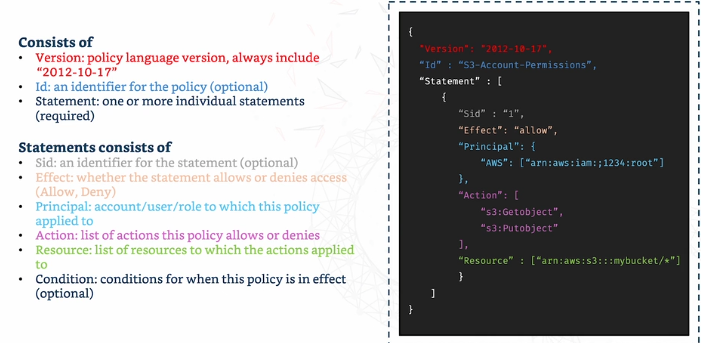
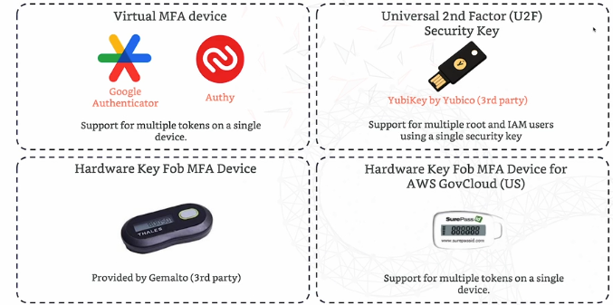

# **IAM**

## What it is?

IAM is short for Identity and Access Management, and is the most important service on AWS. 

## Things it can do:

- **Users & Groups**- it allows users and groups to be made to **manage access** services on AWS.
- **Policies** - Define the rules for what users and groups can and can’t do.
- **MFA (Multi Factor Authentication)** - Its an extra security feature to AWS accounts, which requires a code from a mobile device in addition to the password of an account (like a 2nd lock on a door).
- **Access** - Controls who has access to AWS resources.

## **Users & Groups**

All AWS accounts have Root accounts, which is the account that has full access to everything in AWS. This is like the master key and shouldn’t be given to everyone so instead individual users should be made with their own logins with their permissions.

**Root account** - Created by default and shouldn’t be used or shared.

**Users** - are people within your organisation and can be grouped.

**Groups** - only contain users and not other groups so groups cant be within another. Users can also be in multiple groups too.

## Policies

Users and groups are assigned JSON files that define their permissions like a Rule Book. The golden rule when giving permissions is the **Least Privilege Principle**, which means to not give a user more permissions than they need (making it safe and efficient).

Users can inherit policies from both groups and inline policies which allows policies to be given to individual users.

### **JSON Policy Structure:**

### Password Policy

This Password Policy can be enforced onto users for a more secure password.

Setup options:

- Minimum password length
- require uppercase, lowercase, numbers and non-alphanumeric characters in the password
- allow users to change password
- require users to change their passwords after a certain period
- Prevent from reusing old passwords when changing the password.

## MFA

Its an extra layer of security required when logging-in in addition to the password. Users are requested to enter a one-time code generated on their mobile devices.

#### MFA Device Options:

## **Access**

### Ways users can access AWS:

- **AWS management console -** This is AWS web interface which is accessed with a password and MFA. This is where manual tasks and be done called **ClickOps**.
- **AWS Command Line Interface (CLI)** - The CLI can automate task with scripting and can only be accessed with access keys.
- **AWS Software  Developer Kit (SDK)** - This is used by applications that need to interact with AWS automatically and is protected with access keys.

**Access Keys** are generated through the AWS console and each user is responsible for managing their own keys. 

Access key ID ~= Username

Secret Access key  ~= Password

## IAM Roles

Roles are identities that have permissions but are not associated with a specific user.

They are commonly used to grant AWS services temporary permissions without requiring access keys.

Examples:

- EC2 instances accessing S3
- Lambda functions accessing DynamoDB
- Cross-account access

## IAM Security Tools

Its used to manage AWS users and their permissions. The two tools are:

- IAM Credentials Report - Shows all user in your AWS account and the status of their different credentials. so you can see what users has access keys, MFA and when a user last changed their password. This is a great way to keep tabs on your accounts security.
- IAM Access Advisor - This tool shows each user’s permission and when they were last accessed. If a user hasn’t used a permission for a while you can remove it so maintain the least privilege principle.

## Best IAM Practices

- Use the root account only for initial setup
- Don’t share AWS users or Access keys (1 person for each AWS user)
- Assign permissions to groups and then a user to a group
- Create strong password policy
- Enforce MFA
- Use IAM security tools often
- Treat access keys like passwords
